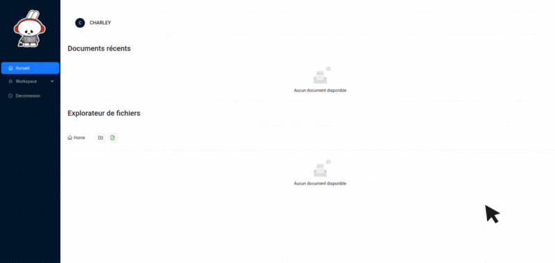
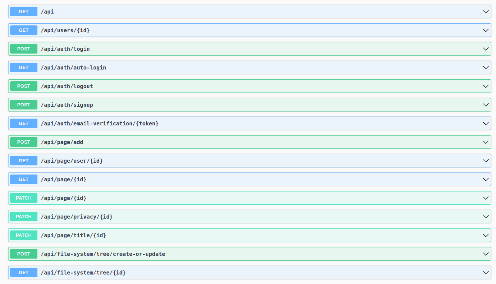

# BIENVENUE SUR L'APPLICATION POLYNOTES

  <p align="center">
      
  </p>

## PRÉSENTATION DE L'APPLICATION

Bonjour et bienvenue à tous,

Je suis ravi de vous présenter aujourd'hui l'application Polynotes, qui a été développée dans le cadre d'un projet scolaire WOA (Web Oriented Architecture).

Polynotes est une application web qui vise à faciliter la gestion de notes, de tâches et de bases de données, en offrant une flexibilité et une personnalisation accrues. Cette application se déroulera en deux itérations : la première itération est présentée ici, tandis que la seconde itération sera réalisée en équipe.

Nous espérons que cette première itération de Polynotes vous sera utile et vous invitons à découvrir de plus près les fonctionnalités de cette application.

[](https://wakatime.com/badge/user/8c51dfaf-cc71-4c33-bb4f-07b1a77dce06/project/6160a20e-1f13-4866-b07b-8adea0765e70)

## Features

### Polynotes Itération V1

Dans cette première itération de Polynotes, les fonctionnalités principales sont les suivantes :

1. **Notes et Wikis :** Vous permet de créer et d'organiser des notes, de la documentation et des wikis dans un format flexible et personnalisable.

2. **Gestion des tâches et des projets :** Vous permet de créer et de gérer des tâches, des listes de tâches et des projets de manière qui convient le mieux à vos besoins.

3. **Bases de données :** Vous permet de créer et de gérer des bases de données pour stocker et organiser des informations telles que les contacts, les produits ou les dépenses.

4. **Partage de documents :** Vous permet de gérer l'accès à vos documents, afin que votre entourage professionnel ou personnel puisse vous aider à les éditer.

# PRÉSENTATION DE LA STACK TÉCHNIQUE

## FRONTEND DEVELOPPEMENT : REQUIREMENTS

Main Library

- [ReactJS](https://fr.reactjs.org/)

UI Libraries Components

- [Ant Design](https://ant.design/docs/react/getting-started)
- [TipTap](https://tiptap.dev/api/editor)
- [DND kit](https://dndkit.com/)

State & HTTP REQUEST management

- [Redux Toolkit](https://redux-toolkit.js.org/)
- [HTTP REQUEST : Axios](https://axios-http.com/fr/docs/intro)

Routing

- [Ract Router 6](https://reactrouter.com/en/main)

## FRONTEND ARCHITECTURE

- :page_facing_up: [Page Authentification :](https://github.com/charley04310/Polynotes/blob/master/frontend/src/pages/auth/WelcomePage.tsx)

  - :jigsaw: [Login](https://github.com/charley04310/Polynotes/blob/master/frontend/src/pages/auth/components/Login.tsx)
  - :jigsaw: [Register](https://github.com/charley04310/Polynotes/blob/master/frontend/src/pages/auth/components/Register.tsx)

- :page_facing_up: [Page Accueil :](https://github.com/charley04310/Polynotes/blob/master/frontend/src/pages/home/HomePage.tsx)

  - :jigsaw: [File Explorer](https://github.com/charley04310/Polynotes/blob/master/frontend/src/pages/home/components/FileExplorer.tsx)
  - :jigsaw: [Recents Files](https://github.com/charley04310/Polynotes/blob/master/frontend/src/pages/home/components/RecentsFiles.tsx)
  - :jigsaw: [User Card](https://github.com/charley04310/Polynotes/blob/master/frontend/src/pages/home/components/UserCard.tsx)

- :page_facing_up: [Page Edit Document :](https://github.com/charley04310/Polynotes/blob/master/frontend/src/pages/document/EditDocumentPage.tsx)
  - :jigsaw: [Sous Page Block](https://github.com/charley04310/Polynotes/blob/master/frontend/src/pages/document/components/SubPage.tsx)
  - :jigsaw: [DataBase Block](https://github.com/charley04310/Polynotes/blob/master/frontend/src/pages/document/components/DataBaseTable.tsx)
  - :jigsaw: [Trello Block](https://github.com/charley04310/Polynotes/blob/master/frontend/src/pages/document/components/TrelloDataBase.tsx)
  - :jigsaw: [Image Block](https://github.com/charley04310/Polynotes/blob/master/frontend/src/pages/document/components/SubPage.tsx)
  - :jigsaw: [Text Editor Block](https://github.com/charley04310/Polynotes/blob/master/frontend/src/pages/document/components/EditorContent.tsx)
  - :jigsaw: [Bubble Menu](https://github.com/charley04310/Polynotes/blob/master/frontend/src/pages/document/components/BubbleMenu.tsx)
  - :jigsaw: [DropDown Menu](https://github.com/charley04310/Polynotes/blob/master/frontend/src/pages/document/components/DropDownMenu.tsx)

### FRONTEND ROUTING : BASIC USAGE

Ce code utilise la bibliothèque React Router pour gérer les routes dans une application React.

Le composant <Routes> définit un groupe de routes. Dans cet exemple, il y a deux groupes de routes : un groupe privé et un groupe public. Les routes privées sont accessibles uniquement aux utilisateurs authentifiés, tandis que les routes publiques sont accessibles à tous les utilisateurs.

```Typescript

//  Pour créer une nouvelle route importer un composant dans les balises "Public" ou "Privé"
<Routes>
    <Route element={<PrivateRoutes isAuthenticated={isAuthenticated} />}>
        <Route path="/any/page" element={<Page />} />
    </Route>
    <Route element={<PublicRoutes isAuthenticated={isAuthenticated} />}>
        <Route element={<Page />} path="/any" />
    </Route>
</Routes>

```

## BACKEND DEVELOPPEMENT : REQUIREMENTS

Framework

- [NestJS](https://nestjs.com/)

Database et ORM

- [MongoDB](https://www.mongodb.com/fr-fr)
- [Mongoose](https://mongoosejs.com/docs/typescript.html)

### API reference

Retrouver une documentation swagger complète [DOCUMENTATION](https://polynotes.cluster-2022-5.dopolytech.fr/api/documentation#/default)

#### Get User information By ID

```http
  GET /api/users/{id}
```

| Parameter | Type     | Description                       |
| :-------- | :------- | :-------------------------------- |
| `token`   | `string` | **Required**. Your API key        |
| `id`      | `string` | **Required**. Id of item to fetch |

#### Login User

```http
  POST /api/auth/login
```

| Parameter  | Type     | Description                 |
| :--------- | :------- | :-------------------------- |
| `email`    | `string` | **Required**. User email    |
| `password` | `string` | **Required**. User password |

#### Signup User

```http
  POST /api/auth/signup
```

| Parameter  | Type     | Description                 |
| :--------- | :------- | :-------------------------- |
| `username` | `string` | **Required**. Username      |
| `email`    | `string` | **Required**. User email    |
| `password` | `string` | **Required**. User password |

#### Logout User

```http
  POST /api/auth/logout
```

| Parameter | Type     | Description                |
| :-------- | :------- | :------------------------- |
| `token`   | `string` | **Required**. Your API key |

#### Email Verification

```http
  POST /api/auth/email-verification/{token}
```

| Parameter | Type     | Description                           |
| :-------- | :------- | :------------------------------------ |
| `token`   | `string` | **Required**. Your Token as URI param |

#### ADD Document

```http
  POST /api/page/add
```

| Parameter | Type       | Description                                 |
| :-------- | :--------- | :------------------------------------------ |
| `pageId`  | `ObjectId` | **Required**. Page ID as Mongoose Object ID |
| `title`   | `string`   | **Required**. Document title                |
| `userId`  | `string`   | **Required**. UserId as string              |
| `content` | `Array`    | **Required**. Content as Array Block        |

#### GET Document by user ID

```http
  GET /api/page/user/{id}
```

| Parameter | Type     | Description                               |
| :-------- | :------- | :---------------------------------------- |
| `token`   | `string` | **Optional**. Optional if shared document |
| `id`      | `string` | **Required**. Id of item to fetch         |

#### UPDATE Document by user ID

```http
  PATCH /api/page/{id}
```

| Parameter | Type     | Description                          |
| :-------- | :------- | :----------------------------------- |
| `content` | `Array`  | **Required**. Content as Array Block |
| `id`      | `string` | **Required**. Id of item to fetch    |

#### UPDATE TITLE Document

```http
  PATCH /api/page/title/{id}
```

| Parameter | Type     | Description                          |
| :-------- | :------- | :----------------------------------- |
| `title`   | `Array`  | **Required**. Content as Array Block |
| `id`      | `string` | **Required**. Id of item to fetch    |
| `token`   | `string` | **Required**. Token cookie           |

#### UPDATE Privacy Document

```http
  PATCH /api/page/privacy/{id}
```

| Parameter    | Type      | Description                                              |
| :----------- | :-------- | :------------------------------------------------------- |
| `token`      | `string`  | **Required**. Token cookie                               |
| `isPublic`   | `Boolean` | **Optional/Required**. To share your document to any one |
| `isEditable` | `Boolean` | **Optional/Required**. To let people edit your document  |

#### POST Tree File System

```http
  POST /api/file-system/tree/create-or-update
```

| Parameter  | Type                | Description                          |
| :--------- | :------------------ | :----------------------------------- |
| `token`    | `string`            | **Required**. Token cookie           |
| `userId`   | `string`            | **Required**. User ID                |
| `key`      | `string`            | **Required**. key generate by uuid() |
| `children` | `NodeFileNavigator` | **Required**. Children file system   |

```typescript
interface NodeFileNavigator {
  title: string;
  key: string;
  // si undefined alors c'est un fichier
  children: NodeFileNavigator[] | undefined;
}
```

#### GET Tree File System

```http
  GET /api/file-system/tree/{id}
```

| Parameter | Type     | Description                        |
| :-------- | :------- | :--------------------------------- |
| `token`   | `string` | **Required**. Token cookie         |
| `id`      | `string` | **Required**. User ID as URI param |


  <p align="center">
      
  </p>

<p align="left">
    <a href="https://www.docker.com/" target="_blank" rel="noreferrer">
        
    </a>
    <a href="https://kubernetes.io" target="_blank" rel="noreferrer">
        
    </a>
    <a href="https://helm.sh/" target="_blank" rel="noreferrer">
        
    </a>
</p>

### CI/CD stack

<p align="left">
    <a href="https://argoproj.github.io/cd/" target="_blank" rel="noreferrer">
        
    </a>
    <a href="https://github.com/actions" target="_blank" rel="noreferrer">
        
    </a>
</p>

## Run locally

```sh
docker compose up
```
