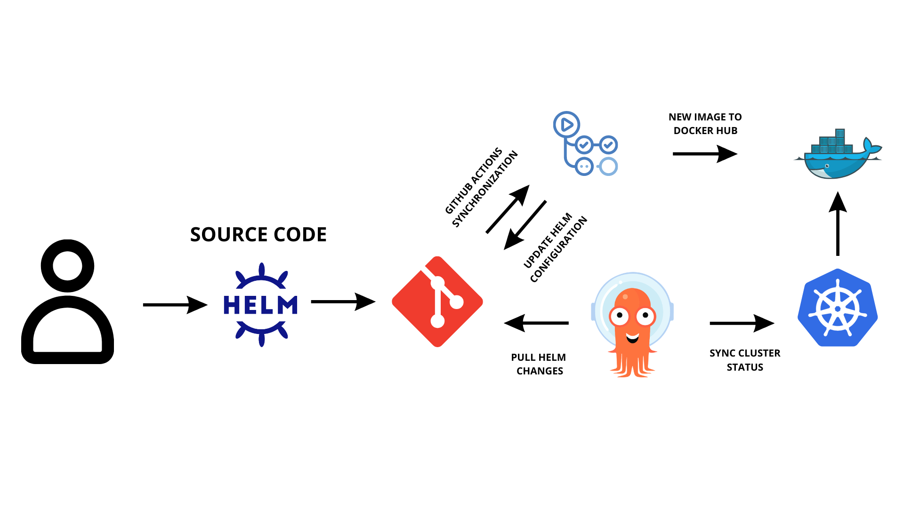
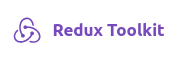

# WELCOME ON POLYNOTES WEB APPLICATION

  <p align="center">
      
  </p>

## Summary

[POLYNOTES WEB APPLICATION](#webapp)

- [Features](#features)
- [Polynotes Iteration V0](#piv0)

[TECHNOLOGY STACK](#ts_01)

- [Frontend STACK presentation](#fs_01)

  - [Requirements](#req_01)
  - [Routes and Components](#rac)
  - [Routing: BASIC USAGE](#rbu)

- [Backend STACK presentation](#bs_01)

  - [Requirements](#req_02)
  - [API reference](#ar)
  - [Mongo DB SCHEMA](#mds)

[DEPLOYMENT](#deployment)

- [Local deployment](#ld)

  - [Requirements](#req_03)
  - [Global environment variables](#gev)
  - [Run locally: docker compose](#rldc)

- [CI/CD Production deployment](#pd)

  - [Requirements](#req_04)
  - [Infrastructure Schema](#is)
  - [Terraform : Setting UP ArgoCD](#tsua)
  - [Terraform : Setting UP sensible secrets](#tsuss)

[TECHNOLOGY STACK: advantages and disadvantages](#tsaad)

- [Frontend stack](#fs_02)
- [Bakcend stack](#bs_02)

## [POLYNOTES WEB APPLICATION](#webapp)

Hello and welcome,

I am pleased to introduce to you today the Polynotes application, which was developed as part of a WOA (Web Oriented Architecture) school project.

Polynotes is a web application aimed at facilitating the management of notes, tasks, and databases by providing increased flexibility and customization. This application will be implemented in two iterations: the first iteration is presented here, while the second iteration will be carried out in a team.

We hope that this first iteration of Polynotes will be useful to you and we invite you to explore the features of this application.

[](https://wakatime.com/badge/user/8c51dfaf-cc71-4c33-bb4f-07b1a77dce06/project/6160a20e-1f13-4866-b07b-8adea0765e70)

## [Features](#features)

### [Polynotes Iteration V0](#piv0)

In this first iteration of Polynotes, the main features are as follows:

1. **Notes and Wikis:** Allows you to create and organize notes, documentation, and wikis in a flexible and customizable format.

2. **Task and Project Management:** Allows you to create and manage tasks, task lists, and projects in a way that best suits your needs.

3. **Databases:** Allows you to create and manage databases to store and organize information such as contacts, products, or expenses.

4. **Document Sharing:** Allows you to manage access to your documents, so that your professional or personal network can help you edit them.

## [Technology stack](#ts_01)

<p align="left">
    <a href="https://www.docker.com/" target="_blank" rel="noreferrer">
        
    </a>
    <a href="https://kubernetes.io" target="_blank" rel="noreferrer">
        
    </a>
    <a href="https://helm.sh/" target="_blank" rel="noreferrer">
        
    </a>
    <a href="https://argoproj.github.io/cd/" target="_blank" rel="noreferrer">
        
    </a>
    <a href="https://github.com/actions" target="_blank" rel="noreferrer">
        
    </a>
    <a href="https://nestjs.com/" target="_blank" rel="noreferrer">
        
    </a>
    <a href="https://www.mongodb.com/" target="_blank" rel="noreferrer">
        
    </a>
    <a href="https://fr.reactjs.org/" target="_blank" rel="noreferrer">
        
    </a>
</p>

### [Frontend stack presentation](#fs_01)

#### [REQUIREMENTS](#req_01)

Main Library

- [ReactJS](https://fr.reactjs.org/)

UI Libraries Components

- [Ant Design](https://ant.design/docs/react/getting-started)
- [TipTap](https://tiptap.dev/api/editor)
- [DND kit](https://dndkit.com/)

State & HTTP REQUEST management

- [Redux Toolkit](https://redux-toolkit.js.org/)
- [HTTP REQUEST : Axios](https://axios-http.com/fr/docs/intro)

Routing

- [Ract Router 6](https://reactrouter.com/en/main)

#### [Routes and Components](#rac)

##### [Page Authentification](https://github.com/charley04310/Polynotes/blob/master/frontend/src/pages/auth/WelcomePage.tsx)

```http
  GET /authentification
```

| Components                                                                                                                 | Description   |
| :------------------------------------------------------------------------------------------------------------------------- | :------------ |
| :jigsaw: [Login](https://github.com/charley04310/Polynotes/blob/master/frontend/src/pages/auth/components/Login.tsx)       | Login VIEW    |
| :jigsaw: [Register](https://github.com/charley04310/Polynotes/blob/master/frontend/src/pages/auth/components/Register.tsx) | Register VIEW |

##### [Page Accueil](https://github.com/charley04310/Polynotes/blob/master/frontend/src/pages/home/HomePage.tsx)

```http
  GET /accueil
```

| Components                                                                                                                          | Description   |
| :---------------------------------------------------------------------------------------------------------------------------------- | :------------ |
| :jigsaw: [File Explorer](https://github.com/charley04310/Polynotes/blob/master/frontend/src/pages/home/components/FileExplorer.tsx) | File Explorer |
| :jigsaw: [Recents Files](https://github.com/charley04310/Polynotes/blob/master/frontend/src/pages/home/components/RecentsFiles.tsx) | Recents Files |
| :jigsaw: [User Card](https://github.com/charley04310/Polynotes/blob/master/frontend/src/pages/home/components/UserCard.tsx)         | User Card     |

##### [Page Edit Document](https://github.com/charley04310/Polynotes/blob/master/frontend/src/pages/document/EditDocumentPage.tsx)

```http
GET /document/{id}
```

| Components                                                                                                                                   | Description       |
| :------------------------------------------------------------------------------------------------------------------------------------------- | :---------------- |
| :jigsaw: [Sous Page Block](https://github.com/charley04310/Polynotes/blob/master/frontend/src/pages/document/components/SubPage.tsx)         | File Sub Page     |
| :jigsaw: [DataBase Block](https://github.com/charley04310/Polynotes/blob/master/frontend/src/pages/document/components/DataBaseTable.tsx)    | DataBase Block    |
| :jigsaw: [Trello Block](https://github.com/charley04310/Polynotes/blob/master/frontend/src/pages/document/components/TrelloDataBase.tsx)     | Trello Block      |
| :jigsaw: [Image Block](https://github.com/charley04310/Polynotes/blob/master/frontend/src/pages/document/components/SubPage.tsx)             | Image Block       |
| :jigsaw: [Text Editor Block](https://github.com/charley04310/Polynotes/blob/master/frontend/src/pages/document/components/EditorContent.tsx) | Text Editor Block |
| :jigsaw: [Bubble Menu](https://github.com/charley04310/Polynotes/blob/master/frontend/src/pages/document/components/BubbleMenu.tsx)          | Bubble Menu       |
| :jigsaw: [DropDown Menu](https://github.com/charley04310/Polynotes/blob/master/frontend/src/pages/document/components/DropDownMenu.tsx)      | DropDown Menu     |

#### [Routing: BASIC USAGE](#rbu)

This code uses the React Router library to manage routes in a React application.

The <Routes> component defines a group of routes. In this example, there are two groups of routes: a private group and a public group. Private routes are only accessible to authenticated users, while public routes are accessible to all users.

```Typescript
//  Pour créer une nouvelle route importer un composant dans les balises "Public" ou "Privé"
<Routes>
    <Route element={<PrivateRoutes isAuthenticated={isAuthenticated} />}>
        <Route path="/any/page" element={<Page />} />
    </Route>
    <Route element={<PublicRoutes isAuthenticated={isAuthenticated} />}>
        <Route element={<Page />} path="/any" />
    </Route>
</Routes>

```

## [Backend STACK presentation](#bs_01)

#### [REQUIREMENTS](#req_02)

Framework

- [NestJS](https://nestjs.com/)

Database et ORM

- [MongoDB](https://www.mongodb.com/fr-fr)
- [Mongoose](https://mongoosejs.com/docs/typescript.html)

### [API reference](#ar)

Check out the full swagger [documentation here](https://polynotes.cluster-2022-5.dopolytech.fr/api/documentation#/default)

#### Get User information By ID

```http
  GET /api/users/{id}
```

| Parameter | Type     | Description                       |
| :-------- | :------- | :-------------------------------- |
| `token`   | `string` | **Required**. Your API key        |
| `id`      | `string` | **Required**. Id of item to fetch |

#### Login User

```http
  POST /api/auth/login
```

| Parameter  | Type     | Description                 |
| :--------- | :------- | :-------------------------- |
| `email`    | `string` | **Required**. User email    |
| `password` | `string` | **Required**. User password |

#### Signup User

```http
  POST /api/auth/signup
```

| Parameter  | Type     | Description                 |
| :--------- | :------- | :-------------------------- |
| `username` | `string` | **Required**. Username      |
| `email`    | `string` | **Required**. User email    |
| `password` | `string` | **Required**. User password |

#### Logout User

```http
  POST /api/auth/logout
```

| Parameter | Type     | Description                |
| :-------- | :------- | :------------------------- |
| `token`   | `string` | **Required**. Your API key |

#### Email Verification

```http
  POST /api/auth/email-verification/{token}
```

| Parameter | Type     | Description                           |
| :-------- | :------- | :------------------------------------ |
| `token`   | `string` | **Required**. Your Token as URI param |

#### ADD Document

```http
  POST /api/page/add
```

| Parameter | Type       | Description                                 |
| :-------- | :--------- | :------------------------------------------ |
| `pageId`  | `ObjectId` | **Required**. Page ID as Mongoose Object ID |
| `title`   | `string`   | **Required**. Document title                |
| `userId`  | `string`   | **Required**. UserId as string              |
| `content` | `Array`    | **Required**. Content as Array Block        |

#### GET Document by user ID

```http
  GET /api/page/user/{id}
```

| Parameter | Type     | Description                               |
| :-------- | :------- | :---------------------------------------- |
| `token`   | `string` | **Optional**. Optional if shared document |
| `id`      | `string` | **Required**. Id of item to fetch         |

#### UPDATE Document by user ID

```http
  PATCH /api/page/{id}
```

| Parameter | Type     | Description                          |
| :-------- | :------- | :----------------------------------- |
| `content` | `Array`  | **Required**. Content as Array Block |
| `id`      | `string` | **Required**. Id of item to fetch    |

#### UPDATE TITLE Document

```http
  PATCH /api/page/title/{id}
```

| Parameter | Type     | Description                          |
| :-------- | :------- | :----------------------------------- |
| `title`   | `Array`  | **Required**. Content as Array Block |
| `id`      | `string` | **Required**. Id of item to fetch    |
| `token`   | `string` | **Required**. Token cookie           |

#### UPDATE Privacy Document

```http
  PATCH /api/page/privacy/{id}
```

| Parameter    | Type      | Description                                              |
| :----------- | :-------- | :------------------------------------------------------- |
| `token`      | `string`  | **Required**. Token cookie                               |
| `isPublic`   | `Boolean` | **Optional/Required**. To share your document to any one |
| `isEditable` | `Boolean` | **Optional/Required**. To let people edit your document  |

#### POST Tree File System

```http
  POST /api/file-system/tree/create-or-update
```

| Parameter  | Type                | Description                          |
| :--------- | :------------------ | :----------------------------------- |
| `token`    | `string`            | **Required**. Token cookie           |
| `userId`   | `string`            | **Required**. User ID                |
| `key`      | `string`            | **Required**. key generate by uuid() |
| `children` | `NodeFileNavigator` | **Required**. Children file system   |

```typescript
interface NodeFileNavigator {
  title: string;
  key: string;
  // si undefined alors c'est un fichier
  children: NodeFileNavigator[] | undefined;
}
```

#### GET Tree File System

```http
  GET /api/file-system/tree/{id}
```

| Parameter | Type     | Description                        |
| :-------- | :------- | :--------------------------------- |
| `token`   | `string` | **Required**. Token cookie         |
| `id`      | `string` | **Required**. User ID as URI param |

### [Mongo DB SCHEMA](#mds)

#### [User SCHEMA](https://github.com/charley04310/Polynotes/blob/master/backend/src/users/schemas/user.schema.ts)

```typescript
export class User {
  // required: true
  username: string;
  // required: true, unique : true
  email: string;
  // required: true, default : false
  email_verified: boolean;
  // required: true
  password: string;
}
```

#### [Page SCHEMA](https://github.com/charley04310/Polynotes/blob/master/backend/src/page/schemas/page.schema.ts)

```typescript
export class Page {
  // required: true
  title: string;
  // required: true
  userId: ObjectId;
  // required: true, default : false
  isPublic: boolean;
  // required: true, default : false
  isEditable: boolean;
  // required: true
  content: [];
}
```

#### [File System TREE SCHEMA](https://github.com/charley04310/Polynotes/blob/master/backend/src/file-system/schemas/file-system.schema.ts)

```typescript
export class FileSystemTree {
  // required: true, unique: true
  userId: string;
  // required: true
  title: string;
  // required: true, unique: true
  key: string;
  // required: true
  children: NodeFileNavigator[];
}
```

## DEPLOYMENT[LOCAL DEPLOYMENT](#deployment)

### [LOCAL DEPLOYMENT](#ld)

#### [REQUIREMENTS](#req_03)

Docker CLI & Docker compose

- [Docker](https://docs.docker.com/engine/reference/commandline/cli/)
- [Docker compose](https://docs.docker.com/compose/)

### [Global environnement variables](#gev)

Prenez soin de renseigner vos propres identifiants afin de bénéficier de la fonctionnalité

```env
// make sur to have your .env init in your project
MONGODB_URL=mongodb://mongo:27017/polynotes
MONGODB_DATABASE=polynotes
MAILER_PASSWORD= ## use your own mailer password
MAILER_PORT= ## use your own mailer port
MAILER_HOST= ## use your own host mailer
MAILER_USER= ## use your own account mailer
JWT_SECRET=  ## use your own jwt secret mailer
BASE_URL_API=http://localhost:3000/api
```

### [Run locally : docker compose](#rldc)

```sh
docker compose up --build
```

## [CI/CD Production deployment](#pd)

#### [REQUIREMENTS](#req_04)

- [Github Actions](https://docs.github.com/fr/actions)
- [K3S](https://k3s.io/)
- [Docker Hub](https://hub.docker.com/)
- [Helm](https://helm.sh/)
- [ArgoCD](https://argo-cd.readthedocs.io/en/stable/)
- [Terraform](https://www.terraform.io/)

> **_Note_**
> You can check out my github actions configuration file [HERE](https://github.com/charley04310/Polynotes/blob/master/.github/workflows/docker-image.yml).You can clone it and feel free to customize it by adding new jobs. Don't forget to be register on Docker Hub and adding your own credentials as bellow

```yml
username: ${{ secrets.DOCKER_USERNAME }}
password: ${{ secrets.DOCKER_PASSWORD }}
```

### [Infrastructure Schema](#is)

<p align="center">


</p>

### [Terraform : Setting UP ArgoCD](#tsua)

#### REQUIREMENTS

- [K8S](https://k3s.io/)
- [ArgoCD](https://argo-cd.readthedocs.io/en/stable/)
- [Terraform](https://www.terraform.io/)

> **Warning**
> Before apply your Terraform configuration make sur to have you Kubernetes distribution installed and ArgoCD set on it. If not check the documentation above before starting it.

1. From Terraform folder setup your Provider as bellow `provider.tf` :

```tf
provider "argocd" {
  server_addr = var.server_addr
  username    = var.username
  password    = var.password

  kubernetes {
    host                   = var.host
    client_certificate     = var.client_certificate
    client_key             = var.client_key
    cluster_ca_certificate = var.cluster_ca_certificate
  }
}
```

2. Then connect your Github repository to ARGOCD as bellow `main.tf` :

```tf
resource "argocd_repository" "<your-argocd-app-name>" {
  repo     = ## your own repository
  type     = "git"
  username = ## your own username
  password =  ## your own password
}
```

3. Create all variables needed as bellow `variables.tf`, check Terraform documentation to get more informations about variables management :

```tf
## ArgoCD
variable "server_addr" {
  description = "ArgoCD server address with port."
  type        = string
}
## K8s
variable "host" {
  description = "The hostname (in form of URI) of the Kubernetes API."
  type        = string
}
```

#### Init and Apply Terraform

> **_Note_**
> Before apply your terraform configuration make sur to init all changes your `terraform.tfstate` by running

```sh
terraform init
```

Then you can apply your configuration

```sh
terraform apply
```

### [Terraform : Setting UP sensible resources](#tsuss)

1. From Terraform folder setup your Provider as bellow `provider.tf` :

```tf
provider "kubernetes" {
  host                   = var.host
  client_certificate     = base64decode(var.client_certificate)
  client_key             = base64decode(var.client_key)
  cluster_ca_certificate = base64decode(var.cluster_ca_certificate)
}
```

2. Then give all the secrets resources that kubernetes need in `main.tf` :

```tf
resource "kubernetes_secret" "<your-argocd-app-name>" {
  metadata {
    name      = "<your-secret-kube-object-name>"
    namespace = "<your-namespace>"
    labels = {
      managed-by = "terraform"
    }
  }
  data = {
    "mongodb-root-password" = ## your own password
    "mongodb-passwords"     =  ## your own password
    "jwt_secret"               =  ## your own JWT secret
    "mailer-password" =  ## your own mail password
    "mongodb-url" = ## your own string connexion

  }
  type = "Opaque"
}
```

#### Init and Apply Terraform

> **_Note_**
> Before apply your terraform configuration make sur to init all changes your `terraform.tfstate` by running

```sh
terraform init
```

Then you can apply your configuration

```sh
terraform apply
```

## [Technology STACK : advantages and disadvantages](#tsaad)

### [Frontend developpement](#fs_02)

#### REACT JS

<p align="left">
    <a href="https://fr.reactjs.org/" target="_blank" rel="noreferrer">
        
    </a>
</p>

**Advantages:** React JS is really popual with :star:**205k** on github repository, so reactjs has a large community and large online documentation and many third-party libraries available.

ReactJS is easy to learn and more permissive than other frameworks like Angular, allowing for greater flexibility in how components are structured and allowing developers to choose their own preferred libraries for state management, routing, and other functionalities.

I also found interesting the way to manage state when reactjs is using with Redux Toolkit.

**Disadvantages:** In contrast to VueJS, ReactJS can be more challenging to learn and use effectively, particularly when managing reactivity. VueJS offers a more straightforward approach with two-way data binding and computed properties, while ReactJS requires managing state changes manually using lifecycle methods and component state.

#### Redux Toolkit

<p align="left">
    <a href="https://redux-toolkit.js.org/" target="_blank" rel="noreferrer">
  
  </a>
</p>

**Advantages:** Redux Toolkit is most popular state manager of react. Comprehensive state management library, easy to use and configure, with a wide variety of features available.

**Disadvantages:** The Redux data flow model can seem a bit verbose for some use cases. Specially when developper want to make async method (createAsyncThunk) inside reducer.

#### Ant Design UI library

<p align="left">
    <a href="https://ant.design/" target="_blank" rel="noreferrer">
  
  </a>
</p>

**Advantages:** Ant design is really popular with :star:**85k** on github repository. The UI component library is well-documented and easy to use, with a wide variety of features available.

**Disadvantages:** UI may seem uninspired, as it is very standardized.

#### TipTap library

<p align="left">
    <a href="https://tiptap.dev/" target="_blank" rel="noreferrer">
  
  </a>
</p>

**Advantages:** TipTap is popular with :star:**18.7k** on github repository.TipTap is Lightweight library for creating rich text editors, with a nice user interface and easy integration with React.

**Disadvantages:** Despite the popularity of the library, the documentation for TipTap can be difficult to navigate and is not always comprehensive or up-to-date.

#### React Router V6.10.0

<p align="left">
    <a href="https://ant.design/" target="_blank" rel="noreferrer">
  
  </a>
</p>

**Advantages:** Routing library for React that is easy to use and configure, with a wide variety of features available.

### [Backend developpement](#bs_02)

#### Nest JS

 <a href="https://nestjs.com/" target="_blank" rel="noreferrer">
        
</a>

**Advantages:** NestJS is a framework that offers a wide range of built-in modules, including Express or authentication management for JWT or Error management standardized. This makes it easy for developers to build complex server-side applications and to maintain it in team.

NestJS also has a well-documented API that is easy to understand and use, making it an ideal choice for novice developper. Additionally, NestJS has a large and active community, with many third-party modules and plugins available to extend its functionality even further.

**Disadvantages:** Despite its many advantages, NestJS can be challenging to learn for developers who are new to the framework. While it offers a lot of functionality out of the box, this can make it overwhelming for beginners to get all of the concepts and best practices.

Additionally, unlike the more flexible approach of Express, NestJS is a strongly opinionated framework that enforces certain conventions and patterns. This can make it difficult for developers who prefer more flexibility and control over their code.

#### MongoDB

  <a href="https://www.mongodb.com/" target="_blank" rel="noreferrer">
      
  </a>

**Advantages:** MongoDB is a popular NoSQL document database that offers a high degree of flexibility and scalability, with support for features like sharding, replication. It has a simple and intuitive query language, and allows for dynamic schema design that can accommodate changing data requirements over time.

**Disadvantages:** While MongoDB's flexibility can be an advantage, it can also introduce potential complexity and require more careful management to ensure data consistency and integrity. Additionally, because MongoDB does not enforce a schema by default, developers may need to invest more time and effort into designing and managing their data models effectively.
